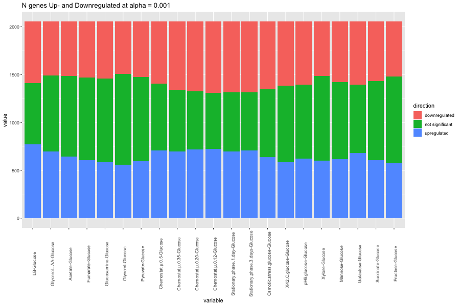
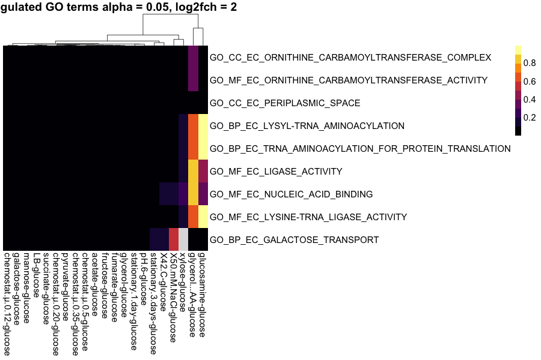
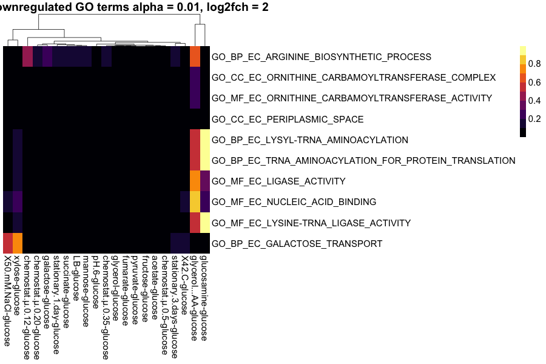

# Differential expression analysis 

## Data

The data used in this notebook comes from the supplementary material of this paper: blabla
It is resampled from counts that represent means and standard deviations.

## Why EdgeR?
- Uses count data 
- Normalization suited for count data, no between probe normalization as for 
 
## Results

*Number of up- and downregulated genes decided by fishers combined method with an alpha cutoff of 0.05*

*Number of up- and downregulated genes decided by fishers combined method with an alpha cutoff of 0.01*

*Number of up- and downregulated genes decided by fishers combined method with an alpha cutoff of 0.001*

# Go term analysis with piano

## Why the given parameters?
- fishers combined test: includes the p-values found by differential expression analysis
- 

## Results

  

